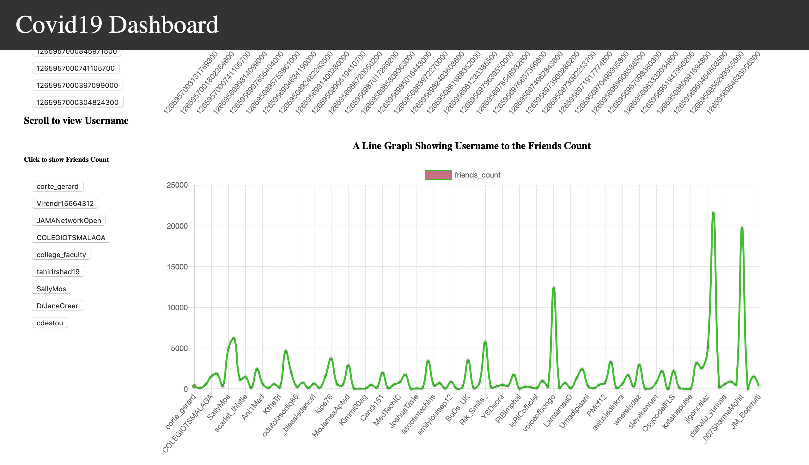

# Covid19 Interaction Graphs
This Django Web Application Project graphically representing data from a Twitter API with covid interactions.

Technologies Used: 
Python 3 = http://python.org  
Python (Django) - https://www.djangoproject.com/  

# How to install: 

Install the requirements with: pip install -r /path/to/requirements.txt  
Run on terminal: python3 manage.py runserver

# Screenshots: 

