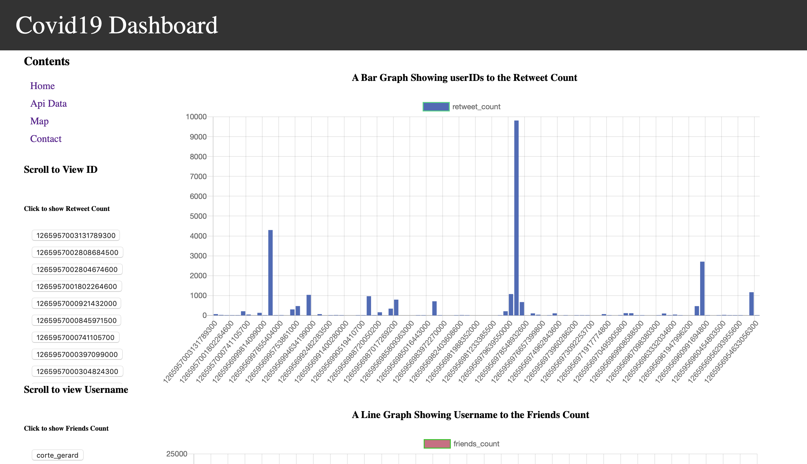

# Covid19 Interaction Graphs
This project is to display tweet information gathered from API into graphs using data analysis tools.

Technologies Used: 
Python 3 = http://python.org
Python (Django) - https://www.djangoproject.com/
Chart.js - http://chartjs.org
High Charts Maps - https://www.highcharts.com/maps/demo

How to install: 

#Screenshots: 

